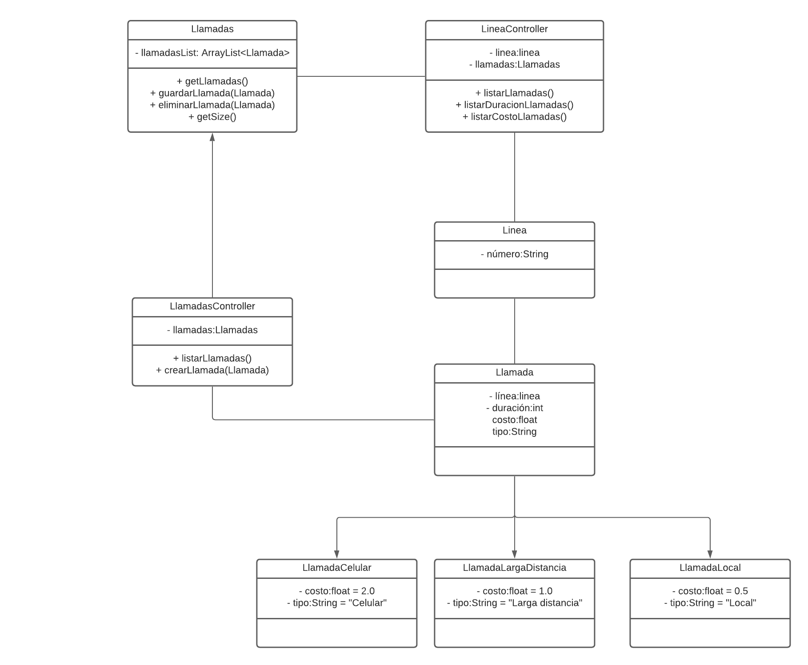

# Lineas Telefónicas
Software de control de líneas telefónicas.

## Descripción
Este repositorio contiene el código de la actividad 2_2 de la clase de "Desarrollo de software".
Se tomaron decisiones de diseño con base en los requerimientos de bigtspace y se puede notar el diagrama de clases en la siguiente imagen.

